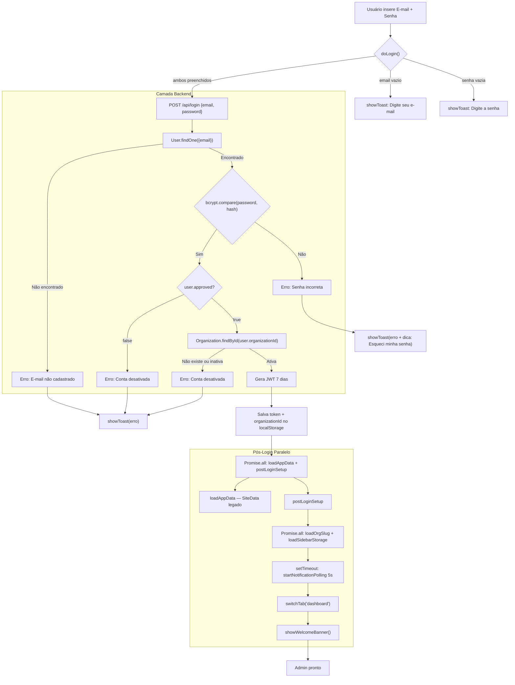
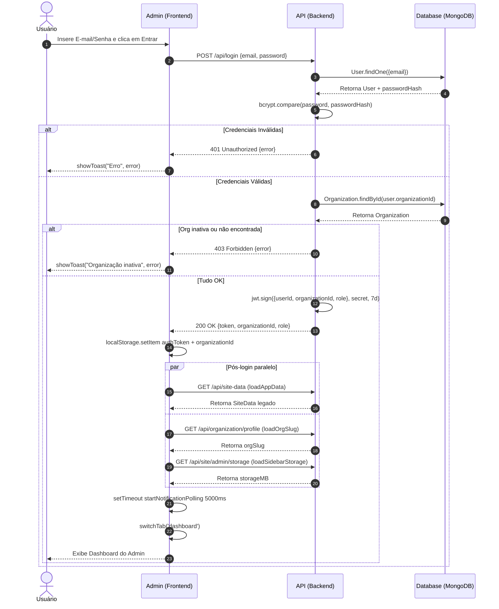
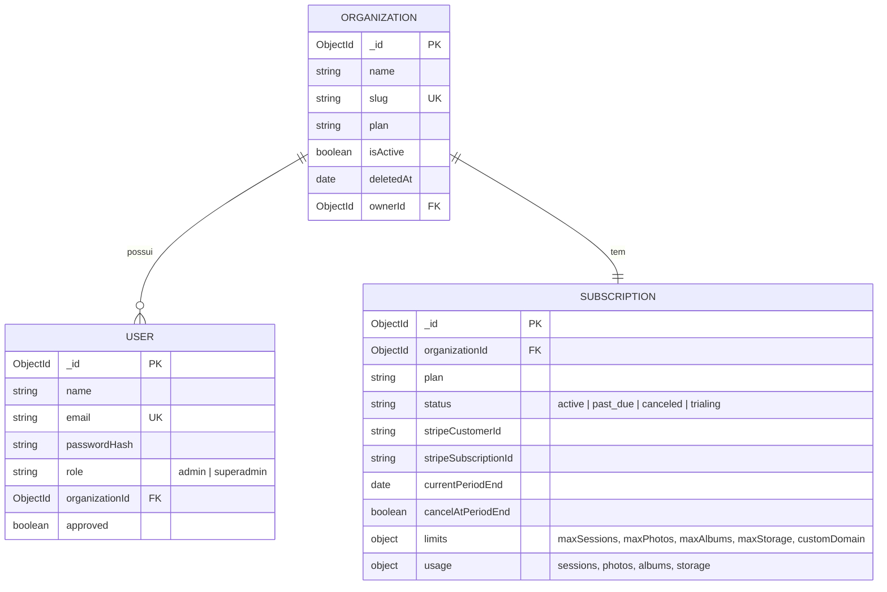
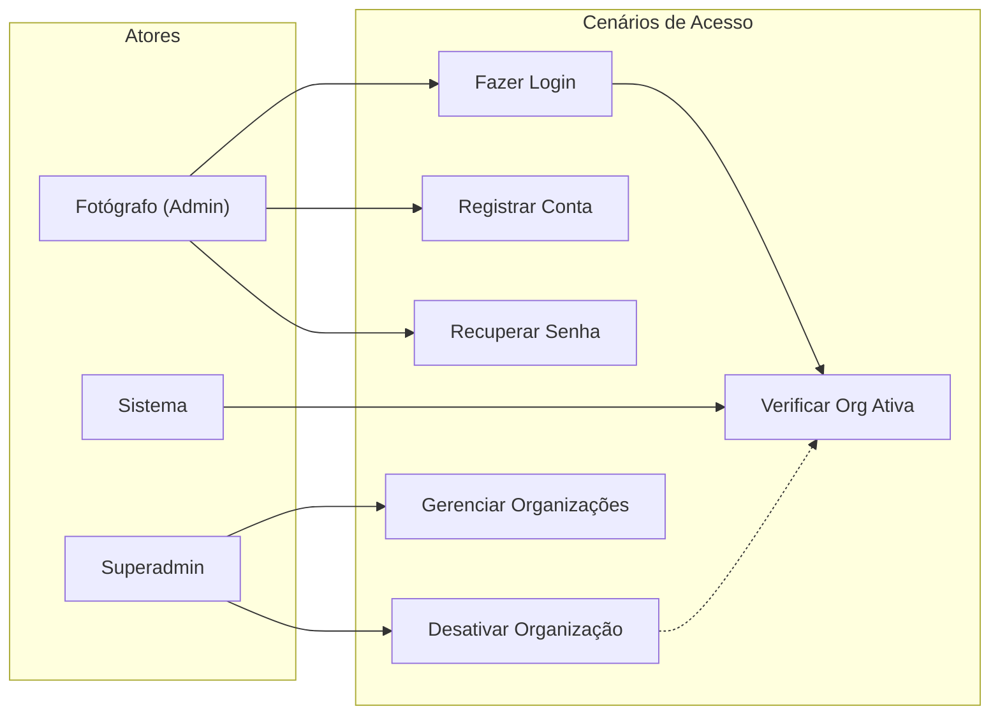
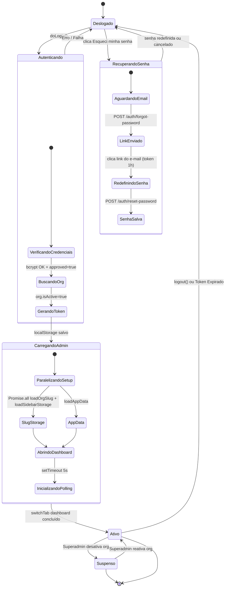

# Skill: Login e Autenticação

Este documento descreve o padrão oficial para o sistema de login e autenticação no CliqueZoom, abrangendo as camadas de Banco de Dados, Backend e Frontend.

## 1. Banco de Dados (Mongoose)

O modelo `User` é central para a autenticação e está vinculado a uma `Organization`.

### Modelo `User` (`src/models/User.js`)
- **Campos Chave**:
  - `name`: Nome do usuário, obrigatório.
  - `email`: Único, em minúsculas e sem espaços.
  - `passwordHash`: Senha criptografada com `bcryptjs`.
  - `organizationId`: Referência obrigatória para a organização (Multi-tenancy).
  - `role`: `admin` ou `superadmin`.
  - `approved`: Flag booleana para controle de acesso manual.
- **Indexação**: Indexado por `organizationId` para consultas rápidas em ambiente multi-tenant.

---

## 2. Backend (Node.js/Express)

A autenticação utiliza **JWT (JSON Web Tokens)** com validade de 7 dias.

### Padrões de Rota (`src/routes/auth.js`)
- **Login (`POST /api/login`)**:
  - Exige `email` e `password` — ambos obrigatórios.
  - Busca usuário com `User.findOne({ email })`.
  - Verifica senha com `bcrypt.compare`, depois `approved === true`, depois busca `Organization.findById()` e verifica `isActive`.
  - Retorna `{ success: true, token, organizationId, role }`.
  - Erros: `"E-mail não cadastrado"` (401), `"Senha incorreta"` (401), `"Conta desativada"` (403).
- **Registro (`POST /api/auth/register`)**:
  - Cria `Organization` com `isActive: true` e `User` com `approved: true` — acesso imediato, sem aprovação manual.
  - Cria `Subscription` no plano free.
  - Atualiza `org.ownerId` após criar o User.
  - Envia e-mail de boas-vindas com link direto para o painel via `sendWelcomeEmail()` (async, não bloqueia).
- **Recuperar senha (`POST /api/auth/forgot-password`)**:
  - Recebe `email`, gera JWT com `purpose: 'reset'` e validade de 1h.
  - Envia link `BASE_URL/admin/?reset=<token>` por e-mail.
  - Sempre retorna 200 — não revela se o e-mail existe.
- **Redefinir senha (`POST /api/auth/reset-password`)**:
  - Recebe `token` e `password` (mín. 6 chars).
  - Valida JWT e `payload.purpose === 'reset'`, atualiza `passwordHash`.

### Regras Críticas de Backend
1. **Require no Topo**: Todos os `require()` devem estar no início do arquivo.
2. **I/O Assíncrono**: Uso obrigatório de `fs.promises` (nunca `*Sync`).
3. **Middleware de Proteção**: Rotas privadas usam `authenticateToken` que injeta `req.user`.
4. **Performance**: Consultas de leitura devem usar `.lean()`.

---

## 3. Frontend (Vanilla JS)

O login é gerenciado no orquestrador principal do admin (`admin/js/app.js`).

### UI de Login (`admin/index.html`)
- Localizado em `#loginForm`, visível apenas quando não há `authToken`.
- **Aesthetics**: Segue o design system com variáveis CSS (`--bg-surface`, `--accent`).
- **Feedback**: Usa `showToast(msg, type)` importado de `./utils/toast.js` (ES Module — não `window.showToast`).
- **Telas**: `loginView`, `forgotView`, `resetView` — controladas por `showView(id)` dentro de `showLoginForm()`.

### Fluxo de Login (`admin/js/app.js`)
O formulário de login tem **3 telas** gerenciadas pela função `showLoginForm()`:
- **loginView**: campos email + senha, link "Esqueci minha senha"
- **forgotView**: campo email para solicitar reset
- **resetView**: campos nova senha + confirmação (ativada via `?reset=<token>` na URL)

1. **Captura**: `doLogin()` valida que email e senha estão preenchidos (ambos obrigatórios).
2. **Requisição**: Envia `{ email, password }` para `POST /api/login`.
3. **Erro de senha**: mensagem inclui dica "Esqueci minha senha".
4. **Persistência**: Armazena `authToken` e `organizationId` no `localStorage`.
5. **Setup Pós-Login**: Executa em paralelo `loadAppData()` (SiteData legado) e `postLoginSetup()`.
   - Dentro de `postLoginSetup()`: paralela `loadOrgSlug()` e `loadSidebarStorage()`, inicia polling de notificações com delay de 5s e abre `switchTab('dashboard')`.
   - NUNCA use `await` em série para chamadas de API independentes.

```javascript
// Padrão real de pós-login em app.js
await Promise.all([
  loadAppData(),       // SiteData legado
  postLoginSetup()     // oculta loginForm, carrega slug+storage, abre dashboard
]);

async function postLoginSetup() {
  document.getElementById('loginForm').style.display = 'none';
  document.getElementById('adminPanel').style.display = 'flex';

  await Promise.all([
    loadOrgSlug(),
    loadSidebarStorage()
  ]);

  setTimeout(startNotificationPolling, 5000);
  await switchTab('dashboard');
  showWelcomeBanner();
}
```

---

## 4. Fluxograma de Autenticação



---

## 5. Diagrama de Sequência



---

## 6. Modelo de Dados (ERD)



---

## 7. Casos de Uso



### Detalhamento dos Casos
1. **Fazer Login**: O fotógrafo autentica com email + senha obrigatórios. Conta é criada já ativa — sem aprovação manual.
2. **Registrar Conta**: Novo usuário cria organização e conta. Acesso imediato — `approved: true` e `isActive: true` desde o cadastro.
3. **Recuperar Senha**: Fotógrafo clica "Esqueci minha senha" → recebe link por e-mail → redefine no próprio formulário de login (token JWT de 1h).
4. **Verificar Org Ativa**: O backend verifica `user.approved` e `org.isActive` a cada login. Bloqueia apenas se o Superadmin desativou manualmente.
5. **Desativar Organização**: Superadmin pode mover org para lixeira (`deletedAt`) ou desativar (`isActive=false`), bloqueando acesso do fotógrafo.
6. **Gerenciar Organizações**: Superadmin monitora métricas, altera planos, restaura orgs da lixeira e gerencia usuários.

---

## 8. Diagrama de Estados



---

## 9. Segurança e Multi-tenancy

- **Isolamento**: Toda consulta ao banco deve incluir `{ organizationId: req.user.organizationId }`.
- **Senhas**: Nunca trafegadas ou armazenadas em texto limpo. Salt rounds = 10.
- **Tokens**: Armazenados no `localStorage` e enviados no header `Authorization: Bearer <token>`.
- **Reset de senha**: Token JWT com `purpose: 'reset'` e validade de 1h. Link enviado por e-mail com `BASE_URL/admin/?reset=<token>`. Token validado no backend antes de atualizar o `passwordHash`.

---

## 10. Checklist de Implementação

- [x] Senha criptografada com salt rounds de 10.
- [x] JWT expira em 7 dias.
- [x] Pós-login paralelo: `Promise.all([loadAppData(), postLoginSetup()])`.
- [x] Dentro de postLoginSetup: `Promise.all([loadOrgSlug(), loadSidebarStorage()])`.
- [x] Polling de notificações com delay de 5s.
- [x] Email obrigatório no login — fluxo legado (senha sem email) removido.
- [x] Cadastro com acesso imediato — `approved: true` e `isActive: true` desde o registro.
- [x] Recuperação de senha via e-mail com token JWT de 1h.
- [x] Formulário de login com 3 telas: login / esqueci senha / redefinir senha.
- [x] Verificação de `approved` e `org.isActive` no backend (bloqueia apenas se Superadmin desativou).
- [x] Uso de variáveis CSS no formulário de login.
- [x] Tratamento de erros com `showToast` (ES Module import, não window.showToast).


# regras de que eu preciso ter ou testar

1. **Higiene do Banco de Dados (Login e Cadastro):**
   - **Tabela `users`:**
     - **Campos Ativos:** `email`, `passwordHash`, `name`, `role`, `organizationId`, `approved`.
     - **Análise:** Tabela **LIMPA**. Segue rigorosamente o padrão de autenticação JWT do sistema.
   - **Tabela `organizations` (Tenant):**
     - **Campos Críticos:** `name`, `slug`, `isActive`, `ownerId`, `plan`.
     - **Campos Redundantes (Legado vs Ativo):** 
        * `whatsapp` (Raiz) vs `siteConfig.whatsapp` (Site)
        * `email` (Raiz) vs `siteConfig.email` (Site)
        * `address` (Raiz) vs `siteContent.contato.address` (Site)
     - **Análise de Risco:** O sistema utiliza os campos de "Site" para a vitrine pública e os campos de "Raiz" para o perfil administrativo do fotógrafo. Manter ambos por enquanto para evitar quebra no painel admin.
     - **Dependência:** Essencial para resolver qual fotógrafo está logado e qual site exibir.

2. **Coleções Suspeitas (Legado):**
   - **`sitedatas`:** Esta coleção ainda é referenciada em `src/routes/siteData.js` e `src/routes/saasAdmin.js`. Ela serve como uma "ponte" para configurações globais. **NÃO DELETAR**.
