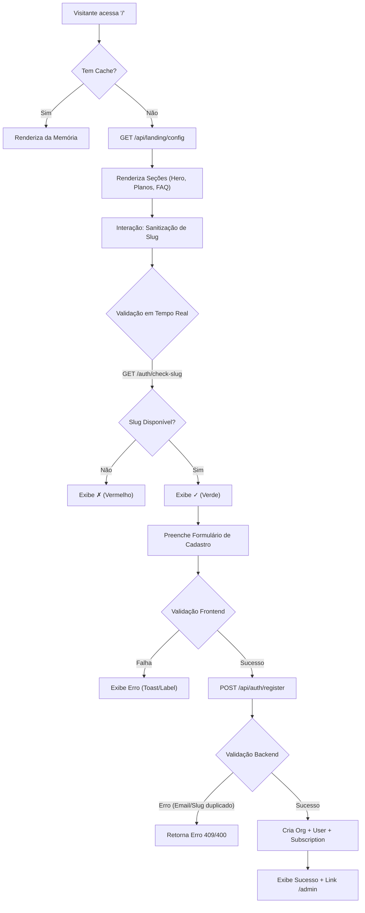
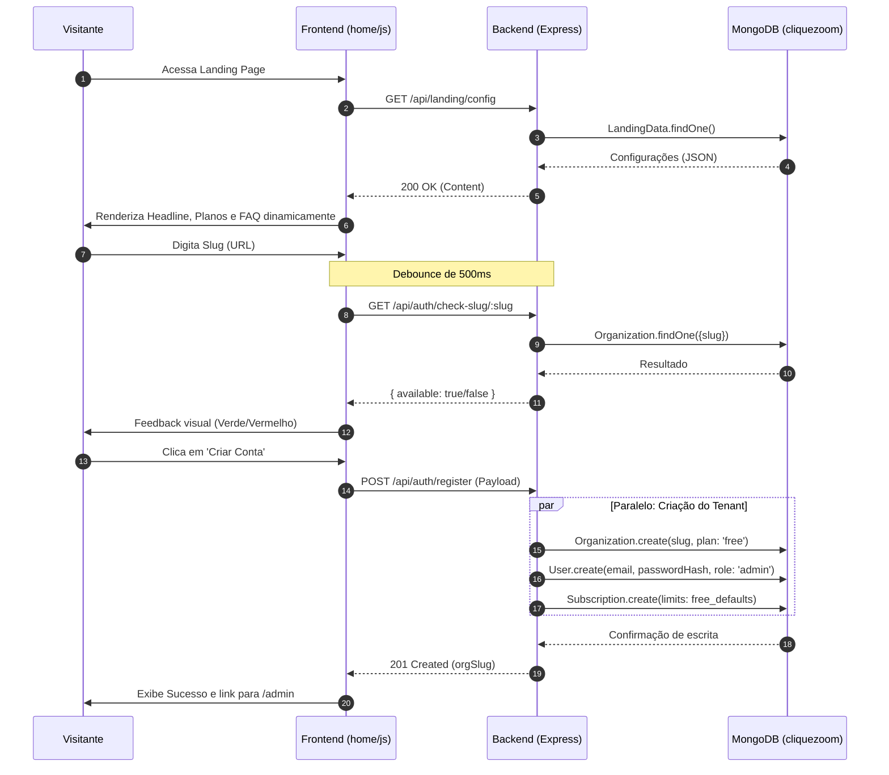
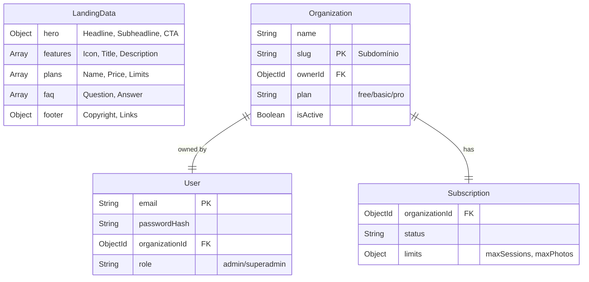
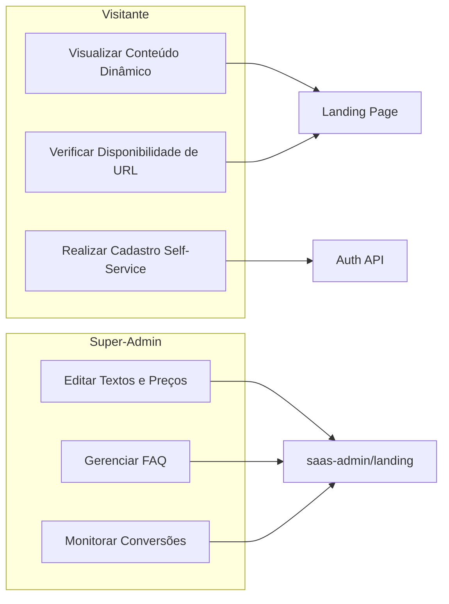
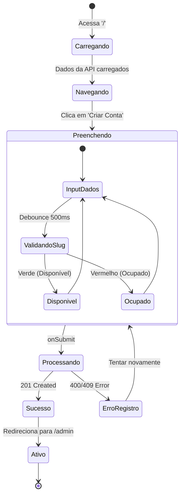

# Skill: Vitrine e Cadastro (Landing Page)

> Leia esta skill para entender a arquitetura da Landing Page (vitrine), o fluxo de registro de novos fotógrafos e como gerenciar o conteúdo dinâmico da plataforma.

---

## ARQUITETURA

A Landing Page é uma Single Page Application (SPA) dinâmica, desacoplada do core do admin para garantir performance e SEO.

- **Frontend:** Localizado em `home/`. Utiliza Vanilla JS e CSS interno. Renderização dinâmica via API.
- **Backend:** Roteador em `src/routes/landing.js` (conteúdo) e `src/routes/auth.js` (registro e validação).
- **Banco de Dados:** Modelo `LandingData` (configurações globais) e `Organization`/`User` (dados do novo assinante).

---

## FLUXOS DE DOCUMENTAÇÃO

### 1. Fluxograma de Execução (Flowchart)

### 2. Diagrama de Sequência (Sequence)

### 3. Modelo de Dados (ERD)

### 4. Casos de Uso (Use Cases)

### 5. Diagrama de Estados (State)

---

## ESPECIFICAÇÕES TÉCNICAS

### 1. Renderização Dinâmica
- O frontend (`home/js/home.js`) utiliza a função `loadLandingConfig()` para buscar os dados de `GET /api/landing/config`.
- Os elementos são preenchidos via `innerHTML` e `textContent` usando seletores de ID específicos (ex: `#heroHeadline`).

### 2. Validação em Tempo Real (Real-time Slug Check)
- **Endpoint:** `GET /api/auth/check-slug/:slug`.
- **Mecânica:** Implementado com **Debounce** de 500ms para evitar sobrecarga no servidor enquanto o usuário digita.
- **Feedback:** Altera a cor e o texto do `#slugPreview` para indicar disponibilidade (✓ Verde / ✗ Vermelho).

### 3. Registro (Auth API)
- Local: `src/routes/auth.js` -> `POST /auth/register`.
- **Ações ao registrar:**
    1. Validação final de E-mail e Slug.
    2. Criação da `Organization` e `User` (Admin).
    3. Inicialização de `Subscription` (Plano Free).
    4. Disparo de E-mail de Boas-vindas.

### 4. Manutenção de Conteúdo
- Todo o conteúdo é gerenciado pela aba **Landing Page** no painel Super-Admin (`/saas-admin`).
- Alterações salvas refletem instantaneamente para todos os visitantes via `LandingData.findOne()`.

# regras de que eu preciso ter ou testar

1. **Higiene do Banco de Dados (Landing Page):**
   - **Tabela:** `landingdatas` (Coleção ativa no MongoDB `cliquezoom`).
   - **Mapeamento Atual:** `hero`, `howItWorks`, `features`, `plans`, `testimonials`, `faq`, `cta`, `footer`.
   - **Análise:** Esta tabela foi criada recentemente e está **100% LIMPA**. Não possui colunas legadas ou dados órfãos.
   - **Dependência:** Essencial para o funcionamento de `GET /api/landing/config`. **NUNCA DELETAR**.

2. **Verificação de Consistência:**
   - Garantir que cada nova seção adicionada ao editor no Super-Admin tenha seu campo correspondente no esquema `LandingData.js` para evitar erros de "Mixed Type".