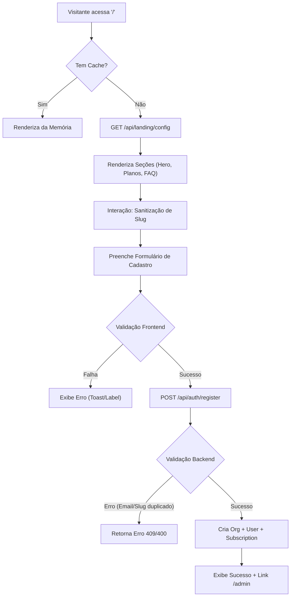
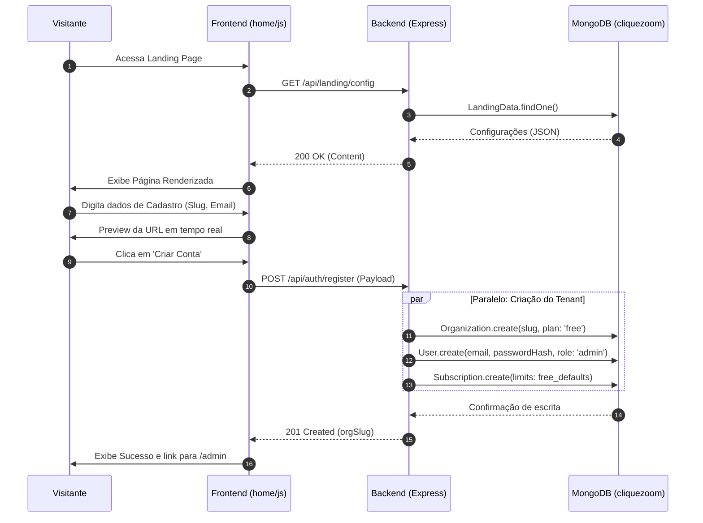
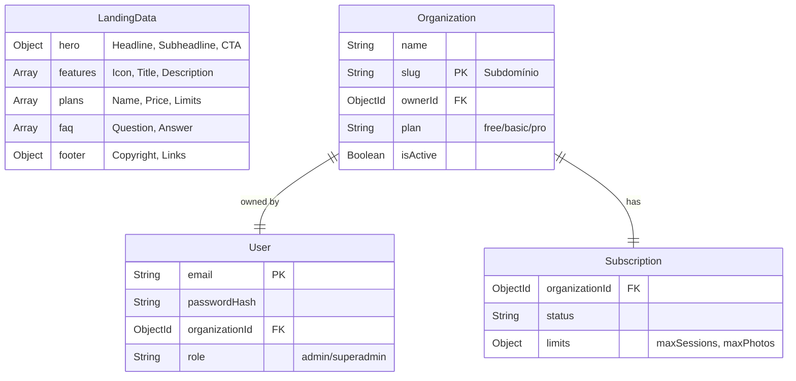
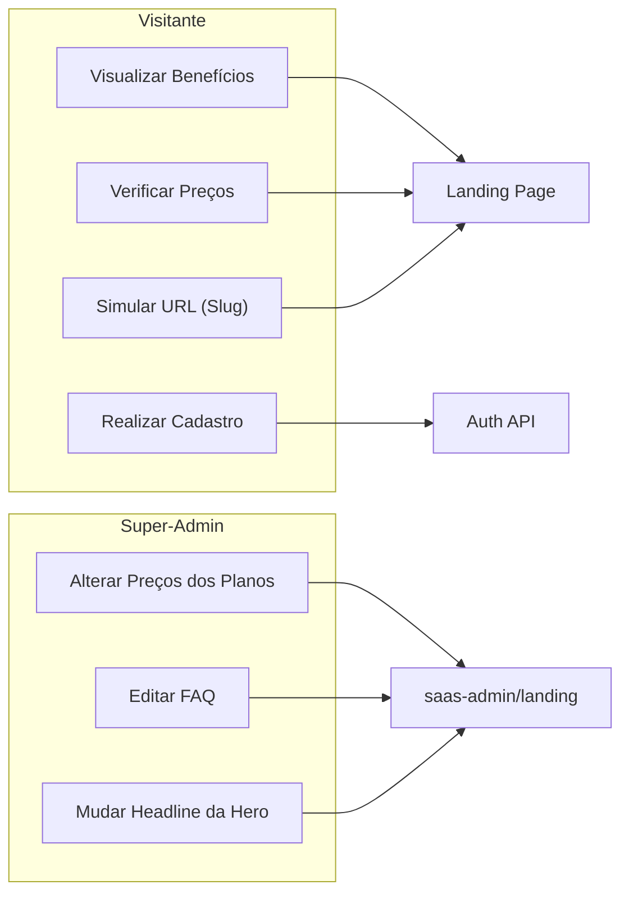
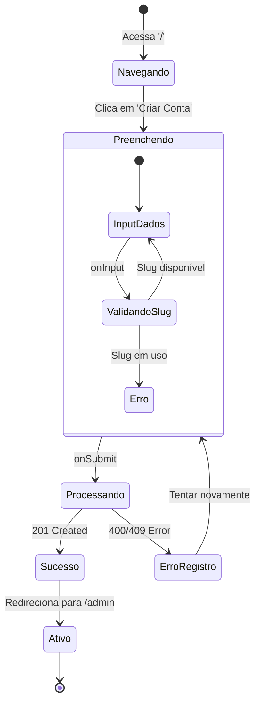

# Skill: Vitrine e Cadastro (Landing Page)

> Leia esta skill para entender a arquitetura da Landing Page (vitrine), o fluxo de registro de novos fotógrafos e como gerenciar o conteúdo dinâmico da plataforma.

---

## ARQUITETURA

A Landing Page é uma Single Page Application (SPA) minimalista, desacoplada do core do admin para garantir performance e SEO.

- **Frontend:** Localizado em `home/`. Utiliza Vanilla JS e CSS interno.
- **Backend:** Roteador em `src/routes/landing.js` para conteúdo e `src/routes/auth.js` para registro.
- **Banco de Dados:** Modelo `LandingData` (configurações globais) e `Organization`/`User` (dados do novo assinante).

---

## FLUXOS DE DOCUMENTAÇÃO

### 1. Fluxograma de Execução (Flowchart)

### 2. Diagrama de Sequência (Sequence)

### 3. Modelo de Dados (ERD)

### 4. Casos de Uso (Use Cases)

### 5. Diagrama de Estados (State)

---

## ESPECIFICAÇÕES TÉCNICAS

### 1. Padrão de Slug
- No frontend (`home/js/home.js`), o slug é limpo via Regex:
  `value.toLowerCase().replace(/\s+/g, '-').replace(/[^a-z0-9-]/g, '').replace(/-{2,}/g, '-')`
- No backend, o slug é a **chave primária lógica** para multi-tenancy.

### 2. Conteúdo Dinâmico (`LandingData`)
- O site não é 100% estático. Ele busca o conteúdo de `GET /api/landing/config`.
- Caso o banco esteja vazio, o backend cria um documento inicial com valores `default` (conforme definido em `src/models/LandingData.js`).

### 3. Registro (Auth API)
- Local: `src/routes/auth.js` -> `POST /auth/register`.
- **Ações ao registrar:**
    1. Verifica duplicidade de E-mail e Slug.
    2. Cria `Organization` (com `isActive: true`).
    3. Cria `User` com `role: 'admin'`.
    4. Cria `Subscription` com limites do plano `free`.
    5. Dispara E-mail de Boas-vindas (`sendWelcomeEmail`).

### 4. CSS e Design
- **Estilo:** Baseado no design system da vitrine (não usa o Stitch Dark do admin).
- **Cores:** Branco (`#fafafa`), Preto (`#1a1a1a`), Verde Sucesso (`#16a34a`).
- **Responsividade:** Mobile-first com Media Queries no final do arquivo `home/index.html`.

---

## MANUTENÇÃO

Para alterar qualquer texto da landing page:
1. Acesse o painel **Super-Admin** (`/saas-admin`).
2. Vá na aba **Landing Page**.
3. Altere os campos e clique em Salvar.
4. O backend atualizará o documento `LandingData` e a mudança refletirá instantaneamente para todos os visitantes.
