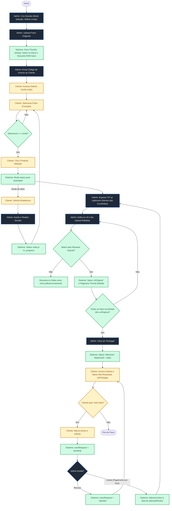
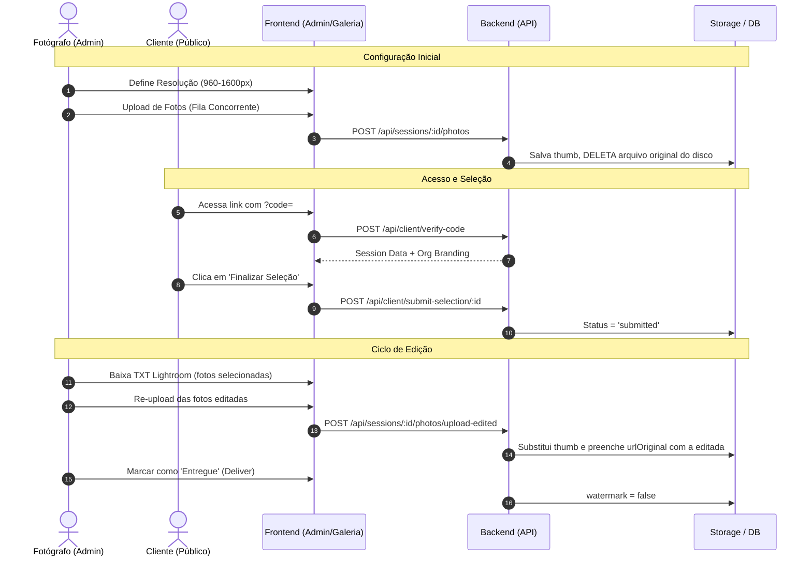
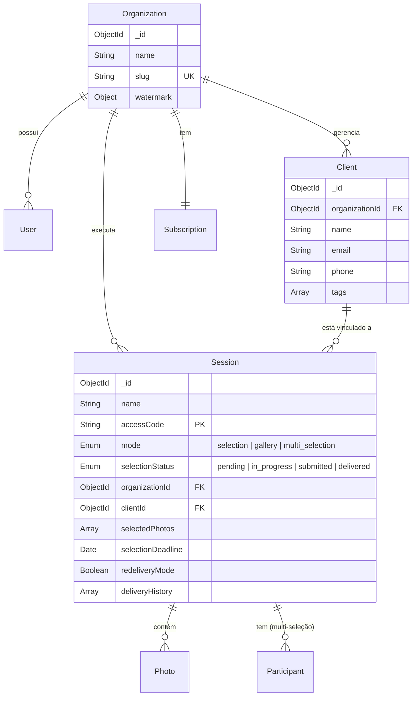
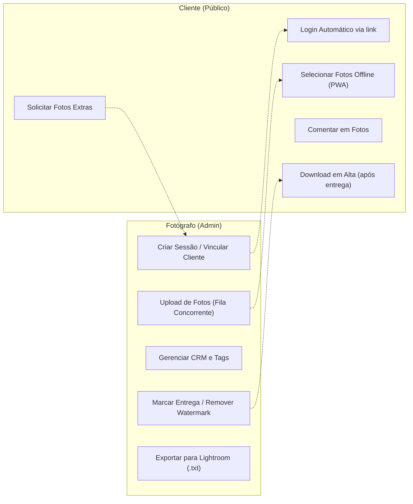
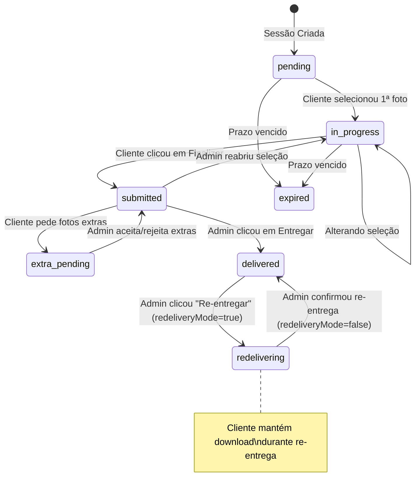

# Grupo 2: Sessões de Clientes e CRM

> Documentação consolidada em 2026-04-24. Atualizada em 2026-04-26 (modularização). Atualizada em 2026-04-27 (re-entrega segura + galeria pós-entrega). Atualizada em 2026-04-28 (fluxo de criação: modo como primeiro campo, multi-seleção sem cliente obrigatório).
> Unifica `Sessões (Admin)`, `Galeria do Cliente (Público)` e `Clientes (CRM)`.
> Referências frontend: `admin/js/tabs/sessoes.js` (proxy) → `admin/js/tabs/sessoes/` (módulos).
> Referências backend: `src/routes/sessions.js`, `src/routes/clients.js`.
> Referências público: `admin/js/tabs/clientes.js`, `cliente/js/gallery.js`.

---

## 1. Visão Geral

O sistema é dividido em três frentes que se comunicam através do `organizationId` (multi-tenancy) e `sessionId`/`clientId`:

1.  **Admin - Sessões**: Onde o fotógrafo cria o trabalho, faz upload de fotos e gerencia a entrega.
2.  **Admin - Clientes (CRM)**: Base de dados de contatos para vinculação rápida às sessões.
3.  **Galeria Pública**: PWA (`/cliente/`) onde o cliente final acessa via código para selecionar ou baixar as fotos.

---

## 2. Fluxos de Documentação

### 2.1. Fluxograma do Fluxo Único (Flowchart)



### 2.2. Diagrama de Sequência (Sequence)



### 2.3. Modelo de Dados (ERD)



### 2.4. Casos de Uso



### 2.5. Diagrama de Estados (Ciclo de Vida Completo)



---

## 3. Modelos de Dados e Regras Negócio

### 3.1. Session (`src/models/Session.js`)
- **`mode`**: `selection` (escolha de fotos), `gallery` (só visualizar/baixar), `multi_selection` (vários participantes).
- **`accessCode`**: Gerado via HEX de 4 bytes. Único por sessão (ou por participante no modo multi).
- **`photoResolution`**: Definido no upload (960 | 1200 | 1400 | 1600). Não pode ser alterado após criação.
- **Fluxo único** (a partir de 2026-04-25): Todo upload gera thumb e deleta o original. A entrega final usa `urlOriginal`, que só é preenchido depois que o fotógrafo re-sobe a foto editada via `POST /sessions/:id/photos/upload-edited`. Quem só quer "entregar pronto" sobe a editada como se fosse o RAW e o ciclo segue igual.
- **`redeliveryMode`** (Boolean, default `false`): Ativado via `PUT /sessions/:id/reopen-delivery`. Permite que o fotógrafo suba fotos editadas e re-entregue mesmo com `selectionStatus === 'delivered'`. O cliente **mantém** acesso ao download durante esse período (status não muda). Limpo para `false` ao confirmar a re-entrega.
- **`deliveryHistory`** (Array): Audit trail de cada ciclo de entrega. Cada entrada contém `{ deliveredAt, selectedCount, extrasDelivered: [String], reopenedAt, reopenReason }`. `extrasDelivered` lista IDs de fotos entregues que não estavam em `selectedPhotos`.

### 3.2. Client (`src/models/Client.js`)
- **Multi-tenancy**: Obrigatório `{ organizationId: 1, email: 1 }` como índice único sparse.
- **Aggregation**: `sessionCount` é calculado on-the-fly via aggregation no `GET /api/clients`.

---

## 4. Rotas e Endpoints Críticos

### 4.1. Públicos (Tenant Context)
- `POST /api/client/verify-code`: Login público. Injeta `organization` data para branding.
- `PUT /api/client/select/:sessionId`: Toggle de foto. Funciona com PWA Sync.
- `POST /api/client/submit-selection/:sessionId`: Trava a seleção para o cliente.

### 4.2. Admin (Auth Context)
- `POST /api/sessions`: Criação com verificação de limites (`checkLimit`).
- `POST /api/sessions/:id/photos`: Upload via Multer + Processamento Sharp.
- `POST /api/sessions/:id/photos/upload-edited`: Re-upload de fotos editadas com regeneração automática de thumbnails. Aceita quando `selectionStatus === 'submitted'` **ou** `redeliveryMode === true`.
- `PUT /api/sessions/:id/deliver`: Valida pré-entrega no backend — bloqueia se qualquer `selectedPhoto` estiver sem `urlOriginal`; identifica extras (fotos com `urlOriginal` mas fora de `selectedPhotos`); registra em `deliveryHistory`; limpa `redeliveryMode`. Dispara e-mail e remove marca d'água.
- `PUT /api/sessions/:id/reopen-delivery`: Exige `selectionStatus === 'delivered'`. Ativa `redeliveryMode = true` sem alterar o status (cliente mantém download). Registra `reopenedAt` no último item de `deliveryHistory`.

#### Validação pré-entrega (frontend `actions.js`)
Antes de chamar `PUT /deliver`, o frontend calcula:
- **`missing`**: fotos em `selectedPhotos` sem `urlOriginal` → bloqueia com toast de erro
- **`extras`**: fotos com `urlOriginal` fora de `selectedPhotos` → pede `showConfirm` explícito listando os nomes
- Mensagem de confirmação diferente para primeira entrega vs re-entrega (`isRedelivery`)

---

## 4.3. Rota crítica — ordem no router

`DELETE /sessions/:id/photos/bulk` **deve** estar registrada ANTES de `DELETE /sessions/:sessionId/photos/:photoId` no mesmo arquivo. Se invertida, Express captura `"bulk"` como `:photoId` e retorna 200 sem alterar o banco.

---

## 4.4. Estrutura do Frontend (Tab Sessões)

A tab foi modularizada em 2026-04-26. `admin/js/tabs/sessoes.js` é um proxy de 1 linha:

```js
export { renderSessoes } from './sessoes/index.js';
```

Estrutura real em `admin/js/tabs/sessoes/`:

| Arquivo | Responsabilidade |
|---|---|
| `index.js` | HTML completo + orquestra todos os módulos |
| `state.js` | Objeto mutável compartilhado (`sessionsData`, `currentSessionId`, etc.) |
| `list.js` | `filterAndRender`, `renderList`, `setupListFilters` |
| `modal-form.js` | Modal Nova Sessão + Modal Editar Sessão |
| `modal-detail.js` | `viewSessionPhotos`, `switchPhotoTab`, bulk delete UI |
| `modal-participantes.js` | `viewParticipants`, add/delete/deliver participante |
| `comments.js` | `openComments`, `renderCommentsList`, envio de comentário |
| `upload.js` | Upload normal, upload de editadas, modal de validação pré-upload |
| `actions.js` | Todas as `window.*` de ação (delete, deliver, reopen, extra, toggleHidden) |

`app.js` não precisou mudar — o `import('./tabs/sessoes.js')` dinâmico continua funcionando via proxy.

---

## 5. Padrões de Interface (UX)

- **Auto-Save**: No admin, mudanças em campos de configuração disparam `saveDados()` imediatamente.
- **Preview Instantâneo**: Ações na galeria do cliente refletem no admin via notificações em tempo real.
- **Fila de Sincronização (Offline)**: A galeria do cliente usa `IndexedDB` para salvar seleções feitas sem internet, sincronizando via `sw.js` ao detectar reconexão.
- **Modal Unificado com Abas (Tabs)**: As telas de "Fotos" e "Entrega Final" foram consolidadas em um único modal, estruturado em **duas Abas exclusivas** (em vez de split vertical). Isso garante 100% da altura da tela para a rolagem, solucionando o encavalamento de grid causado por *aspect-ratio* no Safari ao processar 500+ fotos.
- **Split Button Inteligente**: O botão de upload alterna automaticamente entre "+ Upload" e "✏️ Subir Editadas" com base no status da sessão, mantendo ambas as funções acessíveis via dropdown.
- **Validação Pré-Upload (Entrega)**: Antes de iniciar o re-upload de fotos editadas, o sistema realiza uma análise de nomes de arquivos, seleção do cliente e limites de pacote, solicitando confirmação do fotógrafo caso detecte inconsistências ou brindes extras.
- **Branding Dinâmico**: A galeria pública NUNCA exibe marcas do CliqueZoom; apenas a logo e cores do fotógrafo (`state.session.organization`).

---

## 5.1. Novo Fluxo de Criação de Sessão (2026-04-28)

**Problema resolvido:** O modal de criação pedia "Cliente" como primeiro campo obrigatório, o que não fazia sentido para `multi_selection` (formaturas, shows) onde existem **vários participantes** adicionados depois, não um cliente único.

**Nova abordagem:**

1. **Dropdown "Modo da Sessão"** é o **primeiro campo** — sempre habilitado.
   - Opções: `""` (placeholder: "Escolher modo de sessão"), `"selection"`, `"gallery"`, `"multi_selection"`.

2. **Desbloqueio Progressivo**: Todos os demais campos (cliente, nome, datas, etc.) iniciam com `disabled` e opacidade `0.4`.
   - Ao selecionar um modo, os campos são **habilitados** e opacidade volta a `1`.

3. **Comportamento por Modo**:
   - **Seleção / Galeria**: Campo "Cliente" é **obrigatório** (visível).
   - **Multi-seleção**: Campo "Cliente" fica **oculto** e **não obrigatório** (display: none). Apenas nome do evento é necessário (ex: "Formatura Direito 2026", "Show de Pagode").

4. **Backend (`POST /api/sessions`)**:
   - Valida: Se `mode !== 'multi_selection'` e `!clientId`, retorna erro 400.
   - Multi-seleção pode ser criada com `clientId: null`.

5. **Após Criação**:
   - **Seleção/Galeria**: Fotógrafo faz upload de fotos imediatamente.
   - **Multi-seleção**: Fotógrafo clica em "Participantes" para adicionar os clientes individualmente. Cada participante tem seu próprio `accessCode`, `packageLimit` e fluxo de seleção independente.

**Implementação:**
- `admin/js/tabs/sessoes/index.js` (linhas 72–177): Reordenação HTML do modal, wrapper com `id="sessionFieldsWrapper"`.
- `admin/js/tabs/sessoes/modal-form.js` (linhas 21–45): Função `modeSelect.onchange()` expanda para habilitar/desabilitar campos progressivamente.
- `src/routes/sessions.js` (linha 556): Validação de `clientId` condicional ao modo.

---

## 6. Checklist de Manutenção

- [x] Usar `window.showConfirm()` em vez de `confirm()` nativo.
- [x] Usar variáveis CSS (`var(--accent)`) para garantir compatibilidade com Dark Mode.
- [x] Queries de leitura devem usar `.lean()` para performance.
- [x] Deletes físicos de fotos devem passar por `storage.deleteFile` (via `Promise.all`), lidando corretamente com caminhos absolutos do Multer. Isso inclui `url`, `urlOriginal`, `urlEditada` **e também** `coverPhoto` no delete da sessão.
- [x] Em rotas de upload (`POST /sessions/:id/photos`), processos pesados como o `sharp` devem ter rastreamento em array (ex: `generatedThumbs`). No bloco `catch`, deve-se varrer `req.files` e `generatedThumbs` apagando do disco tudo que vazou durante o erro, evitando arquivos órfãos estruturais.

---

## 7. Detalhamento Operacional dos Fluxos

Dependendo da combinação escolhida pelo fotógrafo no momento da criação, o sistema altera seu comportamento interno:

### 7.1. Impacto da Resolução (960px | 1200px | 1400px | 1600px)
- **Processamento**: O Sharp redimensiona a maior dimensão da foto para o valor escolhido.
- **Armazenamento**: 
    - 960px: Foco total em economia de espaço (ideal para casamentos com 1000+ fotos).
    - 1600px: Foco em qualidade de visualização (ideal para ensaios fine-art).
- **Upload**: O valor é fixo por sessão para garantir que todas as thumbnails tenham o mesmo padrão visual.

### 7.2. Lógica de Matching no Re-upload de Editadas
No fluxo de edição pós-seleção, o sistema realiza um "casamento" automático de arquivos:
1. **Trigger**: Admin clica em "✏️ Upload Editadas".
2. **Identificação**: O sistema varre o array `session.photos` existente buscando o `filename` original.
3. **Validação Inteligente**: 
    - Se o nome não existir: Alerta que o arquivo é novo/renomeado (pode ser adicionado como nova foto via `allowUnmatched`).
    - Se não estiver selecionada: Alerta que é uma entrega extra (brinde).
4. **Substituição e Regeneração**:
    - O arquivo original é substituído no disco.
    - **Thumbnails são regeneradas** via Sharp a partir da foto editada para garantir que a galeria reflita a edição final (cores, cortes, tratamentos).
5. **Feedback**: O sistema reporta sucessos, novas fotos adicionadas e arquivos ignorados.

### 7.3. Ciclo de Fotos Extras (Upselling)
Se o cliente desejar mais fotos que o limite (`packageLimit`):
1. **Solicitação**: Na tela de "Seleção Enviada", o cliente marca as extras e clica em "Solicitar".
2. **Bloqueio**: Enquanto a solicitação está `pending`, o cliente não pode alterar a seleção principal.
3. **Aprovação**: O admin recebe uma notificação. Ao aceitar, o sistema mescla as fotos extras no array `selectedPhotos` permanentemente.

### 7.4. Regras de Download e ZIP

Sempre que `urlOriginal` (foto editada re-subida) estiver presente, o download serve essa versão. Caso contrário, serve a `url` (thumb).

**Comportamento para Fotos Extras Pós-Entrega:**
Quando o cliente solicita fotos extras e o fotógrafo as aprova, a sessão frequentemente já está no status `delivered`. Nesse momento, as fotos recém-aprovadas ainda não possuem `urlOriginal` (ainda não foram tratadas no Lightroom). 
A Galeria do Cliente (PWA) lida com isso avaliando **foto por foto**:
1. **Bloqueio Visual:** A marca d'água é reaplicada nas extras brutas e o botão de download individual é substituído por um selo laranja de **"⏳ Em edição"**.
2. **Avisos:** Um banner informa que há fotos na fila de tratamento. Se o cliente clicar em "Baixar Todas" (ZIP), um alerta avisa que as fotos pendentes de edição não estarão em alta qualidade no arquivo compactado atual.
3. **Liberação Automática:** Assim que o fotógrafo faz o re-upload das editadas, o `urlOriginal` é preenchido. A galeria atualiza sozinha (via polling), remove as marcas d'água e libera as imagens instantaneamente em alta resolução (inclusive para o ZIP dinâmico).
4. **Notificação (Re-entrega):** Clicar em "Confirmar Entrega" no fluxo de Re-entrega do Admin não é o que libera o arquivo, mas sim a ação administrativa para **disparar o e-mail** de notificação final para o cliente, limpar o painel do fotógrafo e registrar no `deliveryHistory`.

> **Nota**: Em sessões no modo `gallery`, o ZIP contém **todas** as fotos da sessão, ignorando limites de seleção.
---

## 8. Matriz de Cenários Reais

A partir de 2026-04-25 só existe um fluxo. A única variável da sessão é a **resolução das thumbs**:

| Cenário | Resolução | Ação do Admin no Início | O que o Cliente vê | Ciclo |
|---|---|---|---|---|
| **L1** | 960px | Sobe fotos (brutas ou já editadas) | Thumbs (960px) | Após seleção, re-upload das editadas |
| **L2** | 1200px | Sobe fotos (brutas ou já editadas) | Thumbs (1200px) | Após seleção, re-upload das editadas |
| **L3** | 1600px | Sobe fotos (brutas ou já editadas) | Thumbs (1600px) | Após seleção, re-upload das editadas |
