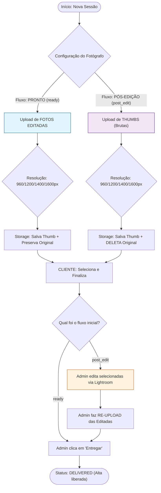
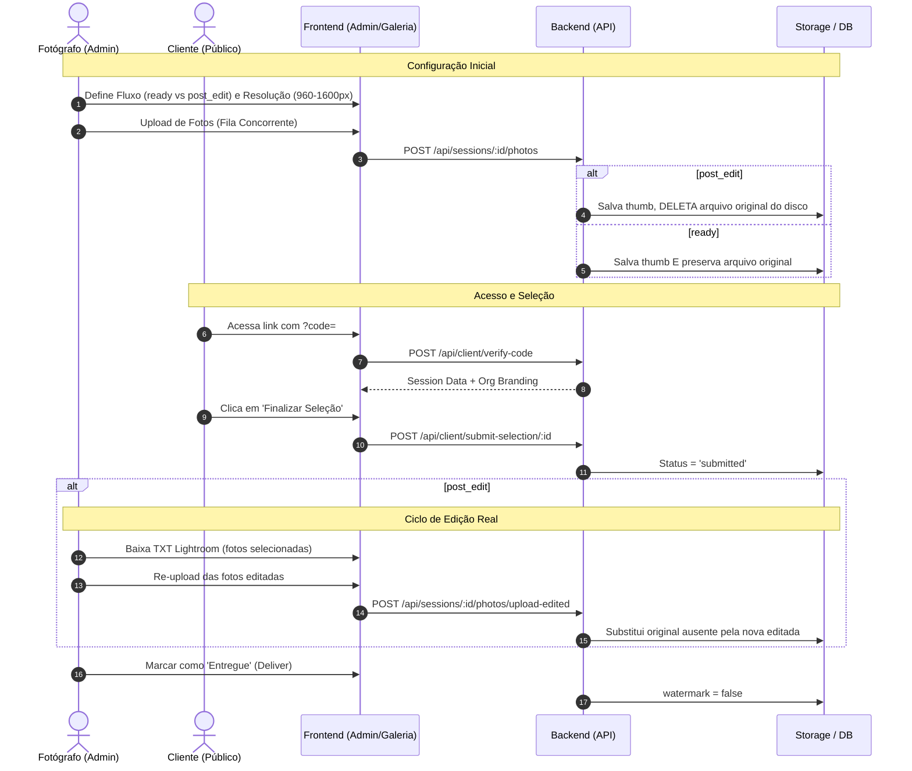
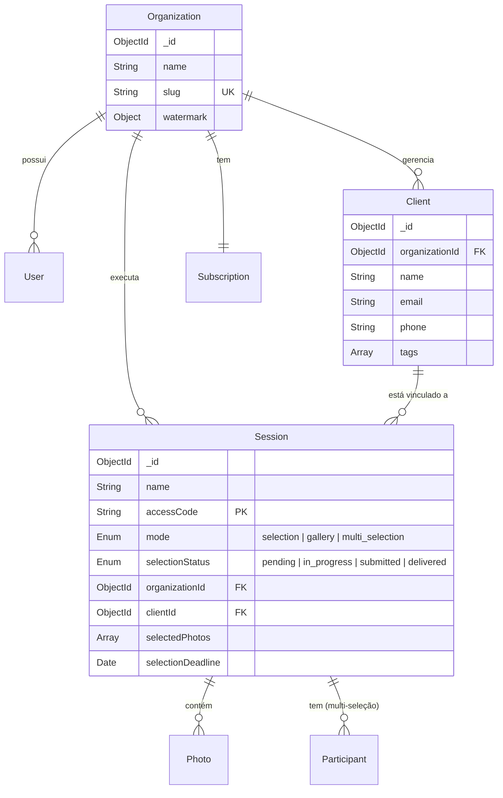
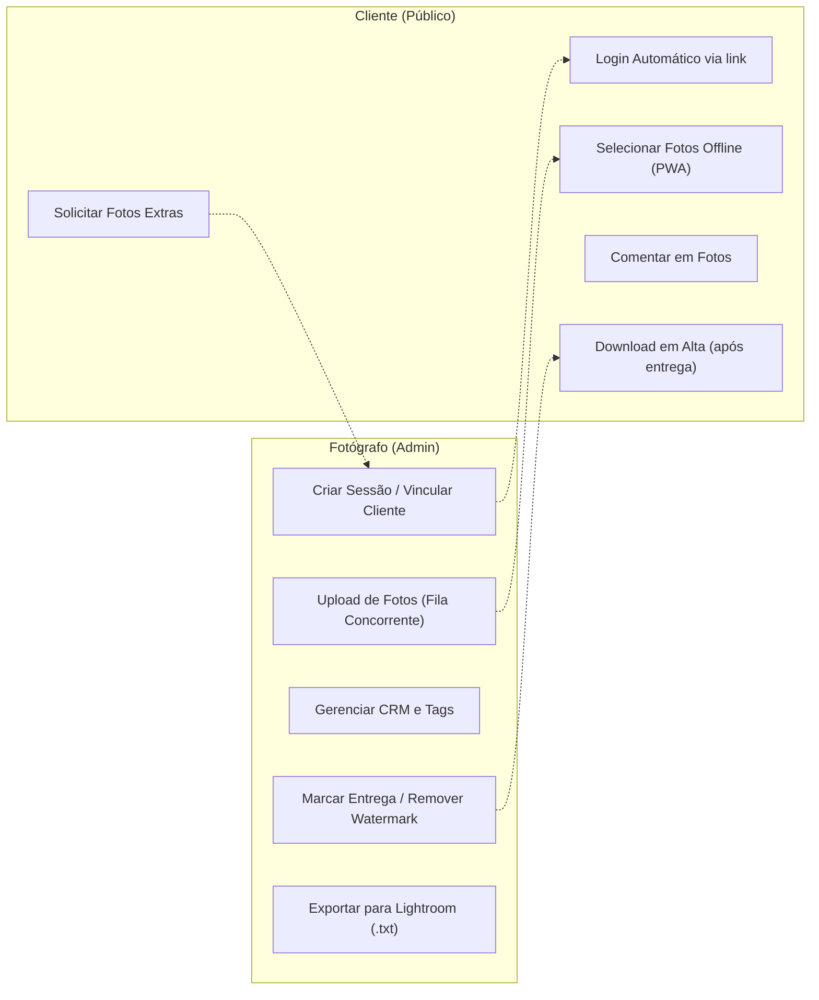
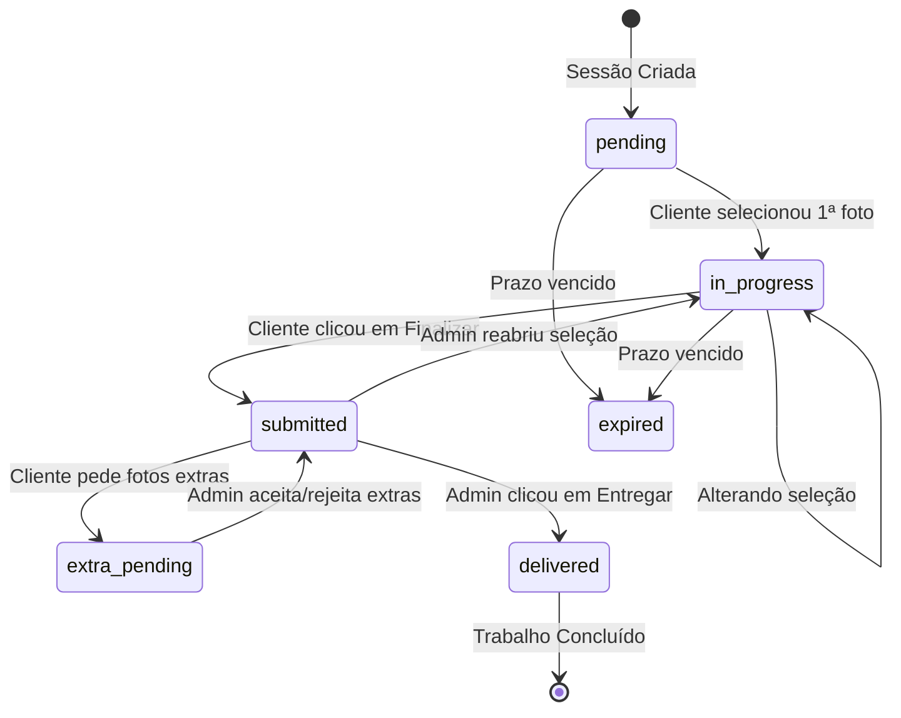

# Grupo 2: Sessões de Clientes e CRM

> Documentação consolidada em 2026-04-24.
> Unifica `Sessões (Admin)`, `Galeria do Cliente (Público)` e `Clientes (CRM)`.
> Referências: `admin/js/tabs/sessoes.js`, `admin/js/tabs/clientes.js`, `cliente/js/gallery.js`, `src/routes/sessions.js`, `src/routes/clients.js`.

---

## 1. Visão Geral

O sistema é dividido em três frentes que se comunicam através do `organizationId` (multi-tenancy) e `sessionId`/`clientId`:

1.  **Admin - Sessões**: Onde o fotógrafo cria o trabalho, faz upload de fotos e gerencia a entrega.
2.  **Admin - Clientes (CRM)**: Base de dados de contatos para vinculação rápida às sessões.
3.  **Galeria Pública**: PWA (`/cliente/`) onde o cliente final acessa via código para selecionar ou baixar as fotos.

---

## 2. Fluxos de Documentação

### 2.1. Fluxograma de Decisão de Fluxo (Flowchart)

### 2.2. Diagrama de Sequência (Sequence)

### 2.3. Modelo de Dados (ERD)

### 2.4. Casos de Uso

### 2.5. Diagrama de Estados (Ciclo de Vida Completo)

---

## 3. Modelos de Dados e Regras Negócio

### 3.1. Session (`src/models/Session.js`)
- **`mode`**: `selection` (escolha de fotos), `gallery` (só visualizar/baixar), `multi_selection` (vários participantes).
- **`accessCode`**: Gerado via HEX de 4 bytes. Único por sessão (ou por participante no modo multi).
- **`photoResolution`**: Definido no upload (960 | 1200 | 1400 | 1600). Não pode ser alterado após criação.
- **`workflowType`**: `ready` (original mantida) ou `post_edit` (original deletada após thumb, requer re-upload das editadas).

### 3.2. Client (`src/models/Client.js`)
- **Multi-tenancy**: Obrigatório `{ organizationId: 1, email: 1 }` como índice único sparse.
- **Aggregation**: `sessionCount` é calculado on-the-fly via aggregation no `GET /api/clients`.

---

## 4. Rotas e Endpoints Críticos

### 4.1. Públicos (Tenant Context)
- `POST /api/client/verify-code`: Login público. Injeta `organization` data para branding.
- `PUT /api/client/select/:sessionId`: Toggle de foto. Funciona com PWA Sync.
- `POST /api/client/submit-selection/:sessionId`: Trava a seleção para o cliente.

### 4.2. Admin (Auth Context)
- `POST /api/sessions`: Criação com verificação de limites (`checkLimit`).
- `POST /api/sessions/:id/photos`: Upload via Multer + Processamento Sharp.
- `POST /api/sessions/:id/photos/upload-edited`: Re-upload de fotos editadas com regeneração automática de thumbnails.
- `PUT /api/sessions/:id/deliver`: Dispara e-mail de entrega e remove marca d'água.

---

## 5. Padrões de Interface (UX)

- **Auto-Save**: No admin, mudanças em campos de configuração disparam `saveDados()` imediatamente.
- **Preview Instantâneo**: Ações na galeria do cliente refletem no admin via notificações em tempo real.
- **Fila de Sincronização (Offline)**: A galeria do cliente usa `IndexedDB` para salvar seleções feitas sem internet, sincronizando via `sw.js` ao detectar reconexão.
- **Modal Unificado com Abas (Tabs)**: As telas de "Fotos" e "Entrega Final" foram consolidadas em um único modal, estruturado em **duas Abas exclusivas** (em vez de split vertical). Isso garante 100% da altura da tela para a rolagem, solucionando o encavalamento de grid causado por *aspect-ratio* no Safari ao processar 500+ fotos.
- **Split Button Inteligente**: O botão de upload alterna automaticamente entre "+ Upload" e "✏️ Subir Editadas" com base no status da sessão, mantendo ambas as funções acessíveis via dropdown.
- **Validação Pré-Upload (Entrega)**: Antes de iniciar o re-upload de fotos editadas, o sistema realiza uma análise de nomes de arquivos, seleção do cliente e limites de pacote, solicitando confirmação do fotógrafo caso detecte inconsistências ou brindes extras.
- **Branding Dinâmico**: A galeria pública NUNCA exibe marcas do CliqueZoom; apenas a logo e cores do fotógrafo (`state.session.organization`).

---

## 6. Checklist de Manutenção

- [x] Usar `window.showConfirm()` em vez de `confirm()` nativo.
- [x] Usar variáveis CSS (`var(--accent)`) para garantir compatibilidade com Dark Mode.
- [x] Queries de leitura devem usar `.lean()` para performance.
- [x] Deletes físicos de fotos devem passar por `storage.deleteFile` (via `Promise.all`), lidando corretamente com caminhos absolutos do Multer. Isso inclui `url`, `urlOriginal`, `urlEditada` **e também** `coverPhoto` no delete da sessão.
- [x] Em rotas de upload (`POST /sessions/:id/photos`), processos pesados como o `sharp` devem ter rastreamento em array (ex: `generatedThumbs`). No bloco `catch`, deve-se varrer `req.files` e `generatedThumbs` apagando do disco tudo que vazou durante o erro, evitando arquivos órfãos estruturais.

---

## 7. Detalhamento Operacional dos Fluxos

Dependendo da combinação escolhida pelo fotógrafo no momento da criação, o sistema altera seu comportamento interno:

### 7.1. Impacto da Resolução (960px | 1200px | 1400px | 1600px)
- **Processamento**: O Sharp redimensiona a maior dimensão da foto para o valor escolhido.
- **Armazenamento**: 
    - 960px: Foco total em economia de espaço (ideal para casamentos com 1000+ fotos).
    - 1600px: Foco em qualidade de visualização (ideal para ensaios fine-art).
- **Upload**: O valor é fixo por sessão para garantir que todas as thumbnails tenham o mesmo padrão visual.

### 7.2. Lógica de Matching no Fluxo `post_edit`
No fluxo de edição pós-seleção, o sistema realiza um "casamento" automático de arquivos:
1. **Trigger**: Admin clica em "✏️ Upload Editadas".
2. **Identificação**: O sistema varre o array `session.photos` existente buscando o `filename` original.
3. **Validação Inteligente**: 
    - Se o nome não existir: Alerta que o arquivo é novo/renomeado (pode ser adicionado como nova foto via `allowUnmatched`).
    - Se não estiver selecionada: Alerta que é uma entrega extra (brinde).
4. **Substituição e Regeneração**:
    - O arquivo original é substituído no disco.
    - **Thumbnails são regeneradas** via Sharp a partir da foto editada para garantir que a galeria reflita a edição final (cores, cortes, tratamentos).
5. **Feedback**: O sistema reporta sucessos, novas fotos adicionadas e arquivos ignorados.

### 7.3. Ciclo de Fotos Extras (Upselling)
Se o cliente desejar mais fotos que o limite (`packageLimit`):
1. **Solicitação**: Na tela de "Seleção Enviada", o cliente marca as extras e clica em "Solicitar".
2. **Bloqueio**: Enquanto a solicitação está `pending`, o cliente não pode alterar a seleção principal.
3. **Aprovação**: O admin recebe uma notificação. Ao aceitar, o sistema mescla as fotos extras no array `selectedPhotos` permanentemente.

### 7.4. Regras de Download e ZIP
O comportamento do download varia conforme o `workflowType` e as configurações:

| Caso | Botão "Baixar Tudo" (ZIP) | Botão "Baixar Individual" |
|---|---|---|
| **Fluxo `ready` + Alta Res** | Serve `urlOriginal` (todas as selecionadas) | Serve `urlOriginal` |
| **Fluxo `ready` + Web Res** | Serve `url` (comprimida) | Serve `url` |
| **Fluxo `post_edit`** | Sempre serve `urlOriginal` (a foto editada) | Serve `urlOriginal` |

> **Nota**: Em sessões no modo `gallery`, o ZIP contém **todas** as fotos da sessão, ignorando limites de seleção.
---

## 8. Matriz de Cenários Reais (Cada Linha de Fluxo)

Esta tabela resume o comportamento para cada combinação que o fotógrafo pode escolher:

| Cenário | Fluxo Escolhido | Resolução | Ação do Admin no Início | O que o Cliente vê | Ciclo de Edição | Entrega Final |
|---|---|---|---|---|---|---|
| **L1** | `ready` | 960px | Sobe fotos editadas | Fotos leves (960px) | Nenhum | Rápida (ready) |
| **L2** | `ready` | 1200px | Sobe fotos editadas | Fotos padrão (1200px) | Nenhum | Rápida (ready) |
| **L3** | `ready` | 1600px | Sobe fotos editadas | Fotos alta-def (1600px) | Nenhum | Rápida (ready) |
| **L4** | `post_edit` | 960px | Sobe fotos brutas | Thumbs (960px) | Edita após seleção | Re-upload editadas |
| **L5** | `post_edit` | 1200px | Sobe fotos brutas | Thumbs (1200px) | Edita após seleção | Re-upload editadas |
| **L6** | `post_edit` | 1600px | Sobe fotos brutas | Thumbs (1600px) | Edita após seleção | Re-upload editadas |
