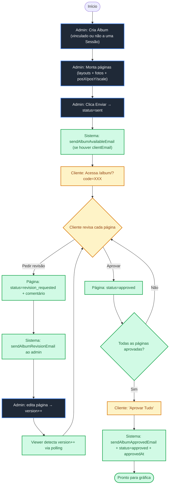

# Skill 3.1 — Prova de Álbum

> Módulo de aprovação de fotolivro/álbum impresso página-a-página, posterior à entrega da sessão. Substitui o ciclo informal de aprovação por WhatsApp por um fluxo rastreável com viewer dedicado e e-mails automáticos.
>
> Referências backend: [src/models/Album.js](../src/models/Album.js), [src/routes/albums.js](../src/routes/albums.js).
> Referências frontend: [admin/js/tabs/albuns-prova.js](../admin/js/tabs/albuns-prova.js) (admin), [album/index.html](../album/index.html) + [album/js/viewer.js](../album/js/viewer.js) (viewer público).

---

## 1. 🎯 Visão Geral

O fotógrafo monta um fotolivro/álbum impresso a partir das fotos já entregues e o cliente revisa **página por página** num link próprio antes de mandar para a gráfica. Cada página pode ser aprovada individualmente ou retornar com pedido de revisão escrito; o álbum como um todo só é dado como aprovado quando todas as páginas estão.

A motivação é resolver o caos de aprovação por WhatsApp (JPGs soltos, perda de histórico, sem registro do que foi pedido em revisão). O viewer público faz polling de versão para refletir alterações do fotógrafo sem precisar de refresh.

## 2. Diferença vs módulo Sessões

| Etapa do projeto | Onde acontece |
|---|---|
| Cliente escolhe **quais** fotos quer | Sessões (modo `selection`) |
| Cliente baixa fotos finais entregues | Sessões (`delivered`) |
| Fotógrafo monta o **fotolivro** com as escolhidas | Prova de Álbum (admin) |
| Cliente aprova layout antes da gráfica | Prova de Álbum (viewer público) |

`Album.sessionId` é **opcional** mas comum — o álbum costuma ser criado depois de uma sessão entregue, reaproveitando suas fotos.

## 3. Modelo de Dados — [src/models/Album.js](../src/models/Album.js)

```javascript
const AlbumSchema = new mongoose.Schema({
  organizationId: { type: ObjectId, ref: 'Organization', required: true, index: true },
  sessionId:      { type: ObjectId, ref: 'Session' },   // opcional
  clientId:       { type: ObjectId, ref: 'Client' },
  name:           { type: String, required: true },
  welcomeText:    { type: String, default: '' },
  status: {
    type: String,
    enum: ['draft', 'sent', 'approved', 'rejected', 'revision_requested'],
    default: 'draft'
  },

  // Páginas do álbum
  pages: [{
    pageNumber: Number,
    layoutType: { type: String, default: 'single' }, // 'single' | 'double-horizontal' | 'double-vertical' | 'triple' | 'quad'
    status: {
      type: String,
      enum: ['awaiting_review', 'approved', 'revision_requested'],
      default: 'awaiting_review'
    },
    comments: [{ text: String, author: String, createdAt: Date }],
    photos: [{
      photoId:  String,         // ID da foto original na sessão
      photoUrl: String,
      position: Number,         // 0..3 (slot dentro do layout)
      posX: { type: Number, default: 50 },  // ajuste fino dentro da moldura
      posY: { type: Number, default: 50 },
      scale: { type: Number, default: 1 }
    }]
  }],

  coverPhoto: String,
  size:       { type: String, default: '30x30cm' },
  totalPages: { type: Number, default: 20 },

  // Versão p/ polling do viewer (incrementa a cada PUT em pages)
  version: { type: Number, default: 1 },

  // Aprovação do cliente
  accessCode:     { type: String, required: true, unique: true },
  approvedAt:     Date,
  clientComments: String,

  isActive: { type: Boolean, default: true }
}, { timestamps: true });
```

**Pontos importantes:**
- `status` global é derivado: vira `revision_requested` quando qualquer página vai pra revisão; vira `approved` quando todas as páginas estão `approved` (lógica em [src/routes/albums.js:218-220](../src/routes/albums.js#L218-L220)).
- `version` é incrementado pelo PUT do admin sempre que `pages` muda ([src/routes/albums.js:113](../src/routes/albums.js#L113)) — o viewer faz polling nesse campo para detectar atualizações.
- `accessCode` é gerado no create como base36 random 6 chars uppercase ([src/routes/albums.js:60](../src/routes/albums.js#L60)).
- DELETE faz soft delete (`isActive: false`).

## 4. Rotas Backend — [src/routes/albums.js](../src/routes/albums.js)

### Admin (autenticadas via `authenticateToken`)

| Método | Path | Função |
|---|---|---|
| GET    | `/api/albums`              | Lista álbuns ativos da org. Filtros opcionais por `clientId` e `status`. Popula `sessionId`. |
| POST   | `/api/albums`              | Cria álbum (passa por `checkLimit` + `checkAlbumLimit`). Gera `accessCode`, incrementa `Subscription.usage.albums`. |
| GET    | `/api/albums/:id`          | Detalhe de um álbum específico. |
| PUT    | `/api/albums/:id`          | Atualiza `name`, `welcomeText`, `status`, `pages`, `coverPhoto`. **Incrementa `version` se `pages` mudou.** |
| POST   | `/api/albums/:id/send`     | Move status para `sent` e dispara `sendAlbumAvailableEmail` se houver `clientId` com e-mail. |
| DELETE | `/api/albums/:id`          | Soft delete (`isActive: false`). |

### Cliente público (apenas `accessCode`, sem login)

| Método | Path | Função |
|---|---|---|
| POST | `/api/client/album/verify-code`                                | Valida o código e retorna o álbum. |
| GET  | `/api/client/album/:id`                                        | Dados das páginas (poll-friendly). |
| PUT  | `/api/client/album/:albumId/pages/:pageId/approve`             | Marca página como `approved`. Se todas estiverem aprovadas, álbum vira `approved` automaticamente. |
| PUT  | `/api/client/album/:albumId/pages/:pageId/request-revision`    | Marca página como `revision_requested`, cria comentário, eleva álbum para `revision_requested` e dispara `sendAlbumRevisionEmail`. |
| POST | `/api/client/album/:albumId/approve-all`                       | Aprovação final agregada. Define `approvedAt` e dispara `sendAlbumApprovedEmail`. |

## 5. Frontend Admin — [admin/js/tabs/albuns-prova.js](../admin/js/tabs/albuns-prova.js)

Single-file ES Module (~550 linhas). Estrutura:

- **Lista por status** com cards coloridos por estágio (`STATUS` map: draft/sent/revision_requested/approved). Cada card mostra contador de páginas pendentes de revisão.
- **Modal de criação** carrega lista de sessões da org via `apiGet('/api/sessions')` e permite vincular o álbum opcionalmente. Após criar, exibe o `accessCode` gerado para o fotógrafo enviar manualmente se preferir.
- **Editor de páginas** (modal wide):
  - Lado esquerdo: fotos da sessão vinculada (quando há `sessionId`).
  - Lado direito: páginas do álbum em ordem, cada uma com seu layout (`single`, `double-horizontal`, `double-vertical`, `triple`, `quad`) e até 4 slots de fotos.
  - Cada página exibe seu próprio status (`PAGE_STATUS`) e comentários de revisão pendentes.
  - Botões de remover página (renumera automaticamente) e adicionar nova.
- **Reabrir revisão**: botão extra aparece quando o álbum está em `revision_requested` para o fotógrafo voltar a editar.

A aba está registrada na sidebar como `data-tab="albuns-prova"` e tem entrada em `TAB_TITLES` em [admin/js/app.js](../admin/js/app.js).

## 6. Viewer Cliente — [album/](../album/)

Pasta **separada** de `/cliente/` (que serve a galeria de fotos). É um HTML estático + JS vanilla:

- [album/index.html](../album/index.html) — UI minimalista com fontes Inter/Playfair Display (alinhada ao DS do admin), tela de login com `accessCode` e container responsivo.
- [album/js/viewer.js](../album/js/viewer.js) — após o `verify-code`, carrega o álbum, renderiza páginas conforme `layoutType`, expõe ações por página (aprovar / pedir revisão com comentário) e botão "Aprovar tudo". Faz **polling** no campo `version` para detectar quando o fotógrafo atualizou as páginas (sem necessidade de refresh manual do cliente).

Não é PWA — é uma página estática servida pelo backend Express na rota `/album`.

## 7. Fluxograma de Aprovação



## 8. 📧 E-mails Automatizados — [src/utils/email.js](../src/utils/email.js)

| Função | Disparo |
|---|---|
| `sendAlbumAvailableEmail(clientEmail, clientName, accessCode, albumName, orgName)` | `POST /api/albums/:id/send` (admin manda álbum para revisão). |
| `sendAlbumRevisionEmail(adminEmail, clientName, albumName, comment, orgSlug)` | Cliente solicita revisão de uma página. |
| `sendAlbumApprovedEmail(adminEmail, clientName, albumName, orgSlug)` | Cliente aprova todas as páginas via `approve-all`. |

Os 3 são disparados com `.catch(() => {})` (best-effort, falha silenciosa).

## 9. 🛠️ Padrões e Regras

### Backend
- CommonJS (`require`).
- Sempre filtrar queries por `organizationId` (tenant isolation).
- Soft delete (`isActive: false`) em vez de remoção física.
- Limites de plano respeitados via `checkLimit` + `checkAlbumLimit` no create.
- `Subscription.usage.albums` incrementado/decrementado para billing.

### Frontend admin
- Vanilla JS, ES Modules.
- Estilo via tokens CSS (`var(--bg-base)`, `var(--accent)`, etc.) — **não** usar Tailwind dentro do arquivo da aba.
- Diálogos via `window.showToast()` / `window.showConfirm()` — proibido `alert/confirm`.
- `escapeHtml` em qualquer texto que vá para o DOM.

### Viewer público
- HTML estático leve, não PWA.
- Polling em `version` é a única forma de o cliente "ouvir" atualizações do fotógrafo — se mudar pra WebSocket no futuro, manter o campo como fallback.

### Geral
- Idioma PT-BR em código, comentários e UI.
- `accessCode` é a única credencial do cliente — não logar nem expor em telemetria.

## 10. 🚧 Limitações Conhecidas / Anti-Escopo

- **Sem checkout integrado** para cobrança da prova ou da impressão — pareado com o backlog [skills/3_0_payment-gateway.md](3_0_payment-gateway.md).
- **Sem geração automática de PDF/JPG de alta** prontos para a gráfica. O fotógrafo ainda monta o arquivo final fora do app a partir do layout aprovado.
- **Viewer público não é PWA** — sem cache offline, sem instalação no home screen. Suficiente para revisão pontual.
- **`sessionId` opcional**: nada impede criar um álbum "solto" sem sessão de origem. Útil para fotólogos que entregam só fotolivro, sem fluxo de seleção.
- **Sem versionamento histórico**: alterações do fotógrafo após `revision_requested` substituem o estado anterior. Comentários ficam, mas não há diff visual entre versões.
- **`status: 'rejected'`** existe no enum mas não há rota nem UI para ativá-lo hoje. Reservado para fluxo futuro de cancelamento de álbum.

---

> [!IMPORTANT]
> O viewer público está em `/album/`, **separado** de `/cliente/`. Não confunda os dois ao adicionar features — galeria de fotos é um produto, prova de álbum é outro.
