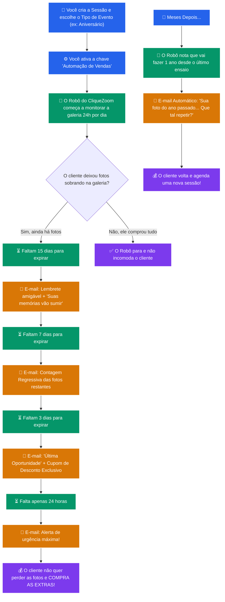

# Skill 4.2 — Visão do Fotógrafo: CRM e Máquina de Vendas

Este documento descreve como o sistema de automação e CRM do CliqueZoom se comporta na perspectiva do **usuário final (o fotógrafo)**. O objetivo é explicar de forma simples e visual o conceito de "venda enquanto você dorme", sem jargões técnicos.

## 🎯 O que é a Máquina de Vendas Automática?

Atualmente, se o seu cliente não compra fotos extras, esse dinheiro fica na mesa. Com a atualização do módulo de Clientes (CRM), o **CliqueZoom passa a atuar como seu vendedor particular**. 

Ele monitora quem abandonou fotos não compradas e cria **gatilhos de urgência, escassez e desconto** de forma totalmente automática, além de lembrar seus antigos clientes que está na hora de fotografar de novo.

Você só precisa fazer uma coisa: **Ligar o botão de automação na hora de criar a sessão.**

---

## 📈 Fluxograma da Experiência do Fotógrafo

Abaixo está o ciclo de vida da automação para o fotógrafo, desde a criação do trabalho até a reativação no ano seguinte.

---

## 📝 Como funciona na prática (Passo a Passo para o Fotógrafo)

Se fôssemos criar um mini-tutorial para apresentar a funcionalidade para o fotógrafo, ele seria assim:

### Passo 1: A Nova Aba "CRM / Automações"
No menu esquerdo do seu painel, você verá a aba **CRM**. Lá, você não precisa configurar servidores, e-mails ou criar campanhas complexas. O painel mostrará apenas:
- Quantos Reais (R$) em fotos estão parados esperando seus clientes comprarem.
- Quantos cupons foram gerados automaticamente pelo robô.
- Um botão simples para Ligar/Desligar as réguas de "Escassez" e "Reativação".

### Passo 2: Cadastrando a Sessão
Ao criar uma nova sessão de seleção, o painel perguntará qual é o **Tipo de Evento**.
Se você escolher *Casamento*, o robô sabe que é um evento único. Se você escolher *Aniversário Infantil* ou *Ensaio de Família*, o robô sabe que pode chamar o cliente de novo ano que vem!

### Passo 3: O Motor de Escassez (Urgência)
O seu cliente escolheu as 30 fotos do pacote, mas deixou outras 20 lindíssimas lá. A galeria vence daqui a 20 dias. 
Você não precisa mandar WhatsApp cobrando. O sistema enviará **4 e-mails estratégicos** progressivamente. No penúltimo, ele receberá um código (Ex: `CZ-PROMO10`) que dá 10% de desconto. Ele chama você no WhatsApp e fecha a venda das 20 fotos restantes movido pela urgência de não perdê-las para sempre.

### Passo 4: A Reativação Anual
Um dos maiores erros do fotógrafo é esquecer os clientes passados. O CliqueZoom não esquece. Exatamente 90 dias antes do próximo aniversário daquele seu cliente, o CliqueZoom pega a primeira foto da sessão do ano passado e manda um e-mail lindo: *"Lembra dessa data? Está chegando a hora de atualizar essas memórias"*.

### Resumo dos Benefícios:
1. **Você foca em fotografar e editar.** O sistema faz o papel de vendedor chato.
2. **Geração de urgência real.** As pessoas compram pelo medo de perder (as fotos vão sumir da nuvem).
3. **Sem esforço técnico.** Não há integração com Mailchimp, RD Station ou configuração de funil. É tudo *plug-and-play*.
